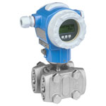

# FIT-103

## Device Details
+ E+H Deltabar S / Venturi
+ PMD75-DAC7F41BAAA
+ F1009C1509D
+ [HART](../indexes/index_devices_hart.md)

## Communication
Use these [instructions](../protocols/hart/hart.md) to communicate with the device using [Fieldcare](../fieldcare/fieldcare.md)

## Configuration
To configure the device follow these [instructions](../commissioning_instructions/deltabar_s_hart.md) using the following configuration parameters

+ Max. Flow 50 USgal/min
+ Max Press. Flow 159.91 inH2O

## Further Reference
[Operating Instructions](../manuals/deltabar_s_operating_hart.pdf)

[Brief Operating Instructions](../manuals/deltabar_s_brief_hart.pdf)
