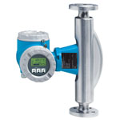

# FIT-106

## Device Details
+ E+H Promass 83
+ 83F50-EFV7/0
+ F10AD316000
+ [Profibus](../indexes/index_devices_profibus.md)

## Communication
Use these [instructions](../protocols/profibus/connection_run_1_HIPROM_192.168.1.13.md) to communicate with the device using [Fieldcare](../fieldcare/fieldcare.md)

## Configuration
To configure the device follow these [instructions](../commissioning_instructions/promass_83_profibus.md) using the following configuration parameters

+ Hardware Address xxx
+ xxx
+ xxx

## Further Reference
[Operating Instructions](../manuals/promass_83_operating_profibus.pdf)

[Brief Operating Instructions](../manuals/promass_83_brief_profibus_ff.pdf)