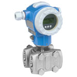

# FIT-201

## Device Details
+ E+H Deltabar S / V-Cone
+ PMD75-UMC7F41BAUA
+ F2002B1509D
+ [Profibus](../indexes/index_devices_profibus.md)

## Communication
Use these [instructions](../protocols/profibus/connection_run_2.md) to communicate with the device using [Fieldcare](../fieldcare/fieldcare.md)

## Configuration
To configure the device follow these [instructions](../commissioning_instructions/deltabar_s_profibus.md) using the following configuration parameters

+ Hardware Address 16
+ Max. Flow 172.245 USgal/min (but no ss tag on v-cone)
+ Max Press. Flow 60 inH2O

## Further Reference
[Operating Instructions](../manuals/deltabar_s_operating_profibus.pdf)

[Brief Operating Instructions](../manuals/deltabar_s_brief_profibus.pdf)