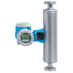

# FIT-206

## Device Details
+ E+H Promass 83
+ 83I50-2P10/0
+ F10AD216000
+ [Foundation Fieldbus](../indexes/index_devices_ff.md)

## Communication
Use these [instructions](../protocols/connection_ff.md) to communicate with the device using [Fieldcare](../fieldcare/fieldcare.md)

## Configuration
To configure the device follow these [instructions](../commissioning_instructions/promass_83_ff.md) using the following configuration parameters

+ Hardware Address 0.30??
+ ???
+ ???

## Further Reference
[Operating Instructions](../manuals/promass_83_operating_ff.pdf)

[Brief Operating Instructions](../manuals/promass_83_brief_profibus_ff.pdf)
