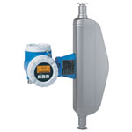

# FIT-306

## Device Details
+ E+H Promass 83
+ 83S50-1QU6/0
+ F1044E16000
+ [Profibus](../indexes/index_devices_profibus.md)

## Communication
Use these [instructions](../protocols/profibus/connection_run_3.md) to communicate with the device using [Fieldcare](../fieldcare/fieldcare.md)

## Configuration
To configure the device follow these [instructions](../commissioning_instructions/promass_83_profibus.md) using the following configuration parameters

+ Hardware Address 24

## Further Reference
[Operating Instructions](../manuals/promass_83_operating_profibus.pdf)

[Brief Operating Instructions](../manuals/promass_83_brief_profibus_ff.pdf)
