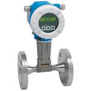

# FIT-401

## Device Details
+ E+H Prowirl 73
+ 73F40-SP2AA1NAB6AH
+ F101C716000
+ [Profibus](../protocols/profibus.md)

## Communication
Use these [instructions](../protocols/profibus/connection_run_4.md) to communicate with the device using [Fieldcare](../fieldcare/fieldcare.md)

## Configuration
To configure the device follow these [instructions](../commissioning_instructions/prowirl_73_profibus.md) using the following configuration parameters

Hardware Address		28

*****

AI block 1 found in impgal/m USgal/m

changed to GPM -
Process Value Scale
Parameter Value
Lower Value 0
Upper Value 1585.03

Output scale
Parameter Value
Lower Value 0 ImpGal/min
Upper Value 1319.81 ImpGal/min

changed to 100 100

## Further Reference
[Operating Instructions](../manuals/prowirl_73_operating_profibus.pdf)

[Brief Operating Instructions](../manuals/prowirl_73_brief_profibus.pdf)