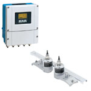

# FIT-403

## Device Details
+ E+H Prosonic Flow 93
+ 93WA1-11AB20RCBAAD
+ EC10D302000
+ [HART](../indexes/index_devices_hart.md)

## Communication
Use these [instructions](../protocols/hart/hart.md) to communicate with the device using [Fieldcare](../fieldcare/fieldcare.md)

## Configuration
To configure the device follow these [instructions](/commissioning_instructions/prosonic_93.md) using the following configuration parameters

+ LRV 0 ??
+ URV ??100 ??

## Further Reference
[Operating Instructions](../manuals/prosonic_93_operating_hart.pdf)

[Brief Operating Instructions](../manuals/prosonic_93_brief_hart.pdf)
