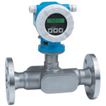

# FIT-404

## Device Details
+ E+H Prosonic Flow 92F
+ 92F40-DSKA5NA0B4AA
+ F10A2816000
+ [HART](../protocols/hart/hart.md)

## Communication
Use these [instructions](../protocols/hart/hart.md) to communicate with the device using [Fieldcare](../fieldcare/fieldcare.md)

## Configuration
To configure the device follow these [instructions](/commissioning_instructions/prosonic_92_hart.md) using the following configuration parameters

+ LRV 0 gal/min
+ URV 60 gal/min

## Further Reference
[Operating Instructions](../manuals/prosonic_92_operating_hart.pdf)

[Brief Operating Instructions](../manuals/prosonic_92_brief_hart.pdf)
