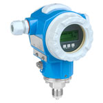

# PIT-202

## Device Details
+ E+H Cerabar S
+ PMP71-UPC1P61RAAAA
+ F101CC1509C
+ [Foundation Fieldbus](../indexes/index_devices_ff.md)

## Communication
Use these [instructions](../protocols/connection_ff.md) to communicate with the device using [Fieldcare](../fieldcare/fieldcare.md)

## Configuration
To configure the device follow these [instructions](../commissioning_instructions/cerabar_s_ff.md) using the following configuration parameters

+ Hardware Address 0.24??
+ ???
+ ???

## Further Reference
[Operating Instructions](../manuals/cerabar_s_operating_ff.pdf)

[Brief Operating Instructions](../manuals/cerabar_s_brief_ff.pdf)
