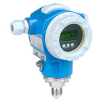

# PIT-306

## Device Details
+ E+H Cerabar S
+ PMC71-UAC1P6RAAAA
+ EC03721509C
+ [HART](../indexes/index_devices_hart.md)

## Communication
Use these [instructions](../protocols/hart/hart.md) to communicate with the device using [Fieldcare](../fieldcare/fieldcare.md)

## Configuration
To configure the device follow these [instructions](../commissioning_instructions/cerabar_s_hart.md) using the following configuration parameters

+ LRV 0 psi
+ URV 100 psi

## Further Reference
[Operating Instructions](../manuals/cerabar_s_operating_hart.pdf)

[Brief Operating Instructions](../manuals/cerabar_s_brief_hart.pdf)
