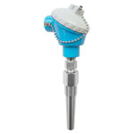

# TIT-301

## Device Details
+ E+H ?????????
+ TMT182-C31DK
+ F10BC423125
+ [HART](../indexes/index_devices_hart.md)

## Communication
Use these [instructions](../protocols/hart/hart.md) to communicate with the device using [Fieldcare](../fieldcare/fieldcare.md)

## Configuration
To configure the device follow these [instructions](../commissioning_instructions/tmt_182.md) using the following configuration parameters

+ LRV ???
+ URV ???

#### Further Reference
[Operating Instructions](file:///C:/Users/Dell/synct/synct_work/eh/sait/operating_manuals/unknown_operating_hart.pdf)
[Brief Operating Instructions](file:///C:/Users/Dell/synct/synct_work/eh/sait/operating_manuals/unknown_brief_hart.pdf)

