# Fieldcare Installation
Fieldcare requires a licence key which has been purchased by SAIT

SAIT's licence key requires FieldCare Package v1.30.00

Endress+Hauser's website only offers the latest packages, which are later than v1.30.00

**It is important to safely backup Fieldcare Package v1.30.00**

FieldCare Package v1.30.00 contains FieldCare SFE500 v2.11.00.2025

To install Feldcare obtain the following files

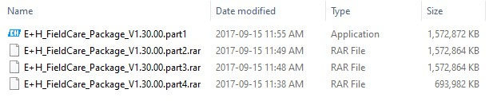

To start the installation double click E+H_Fieldcare_Package_V1.30.00.part1

Choose the destination folder for the extracted files and press 'Install'

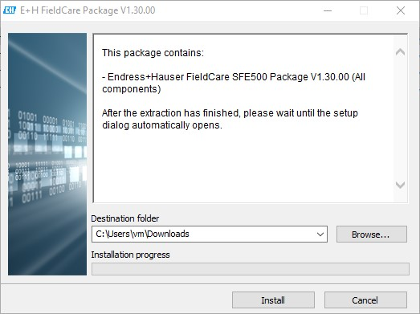

Once complete the following files will have been extracted into the selected destination

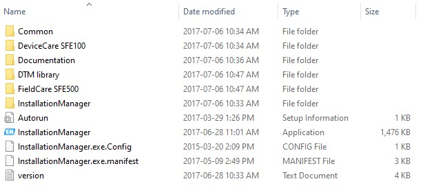

Double click 'InstallationManager'

The Installaton Manager screen will launch

Fieldcare requires .Net v3.5 to be installed.  If prompted follow these [instructions](../manuals/how_to_install_dot_net_35.pdf)

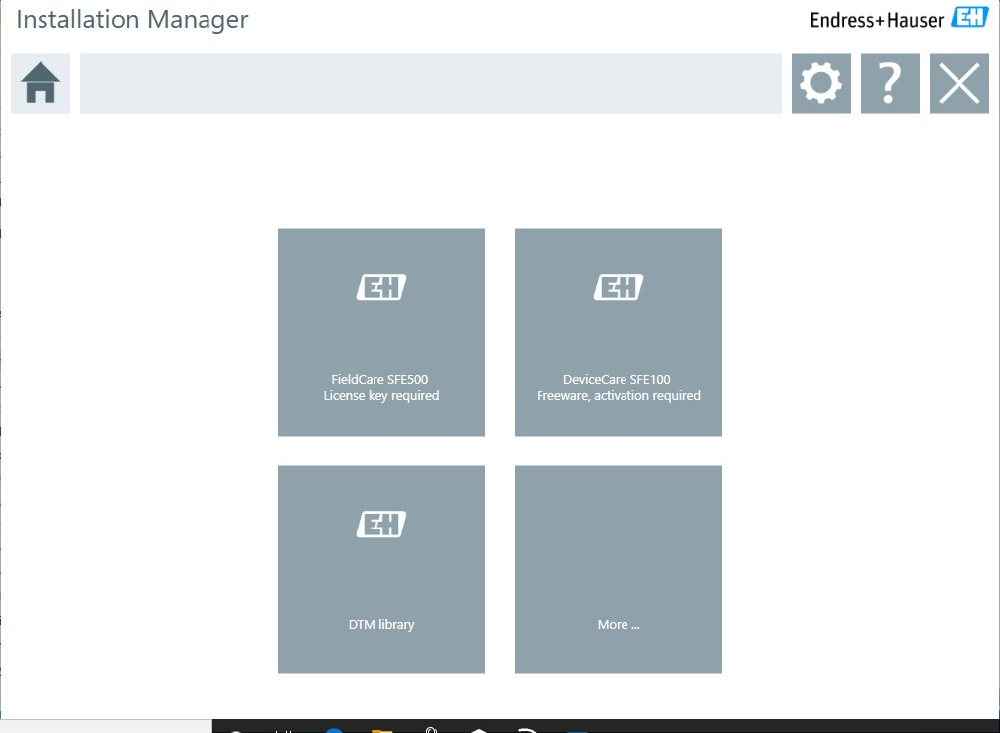

Select 'FieldCare SFE500 - License key required'

Accept the two following agreements

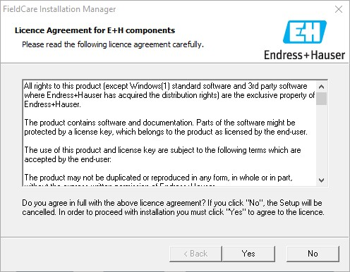
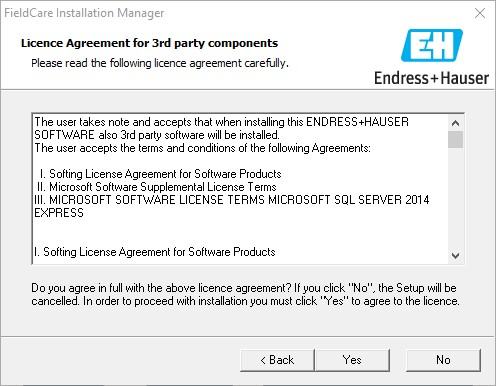

Enter the required Serial Number and License Key

Press Next

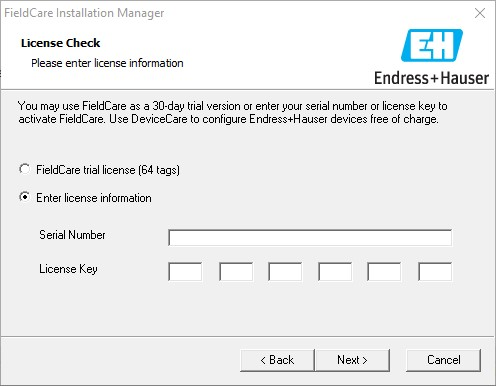

Select the following options as required then 'Next'

Select FieldCare components

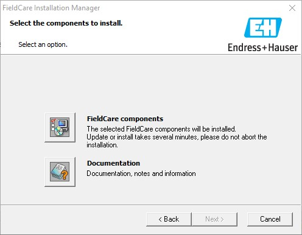

Select all the components shown below

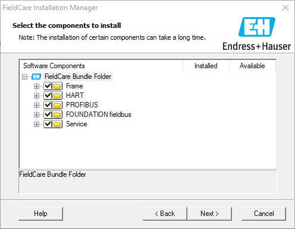

Select Next on the window below

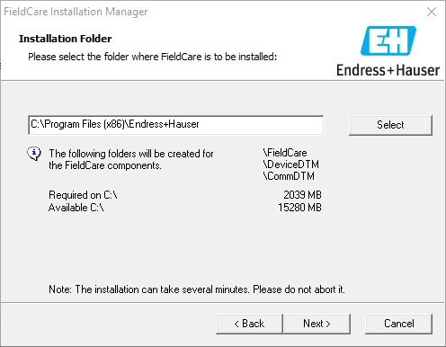

Select Next on the window below

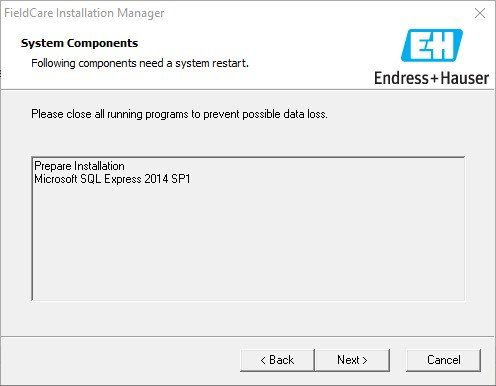

The installation will take some time to complete

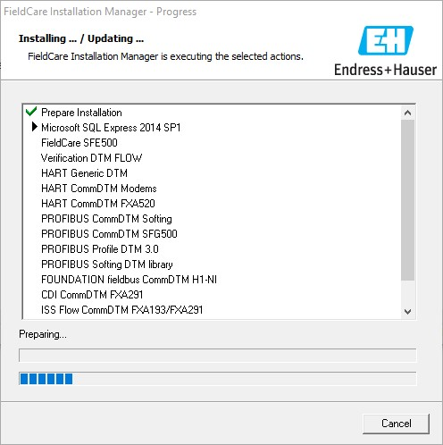

If prompted to install device software click Install

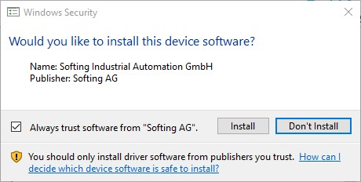

Once complete click Finish

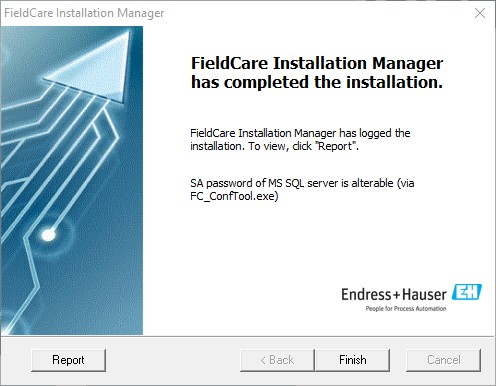

Launch Fieldcare to complete the installation (icon on Desktop)

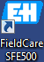

For the initial run the DTM Catalog will be empty, select Update

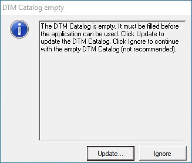

Fieldcare will take several minutes searching for installed DTMs

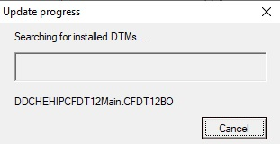

Once complete the DTM Catalog will be displayed

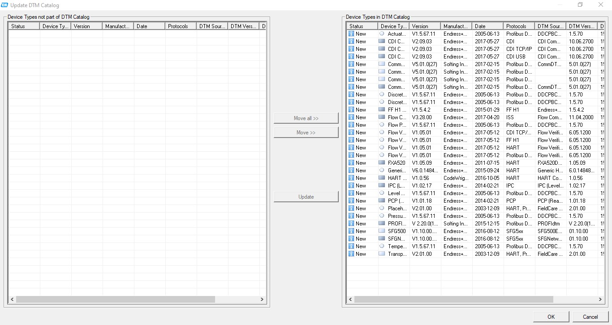

The basic install of Fieldcare does not contain any individual device DTMs

To add DTMs to the catalog goto [Update DTM Catalog](fieldcare_update_dtm_catalog.md)

