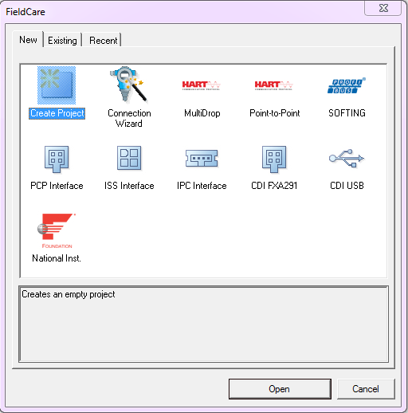
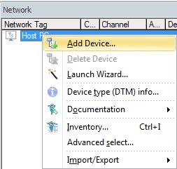
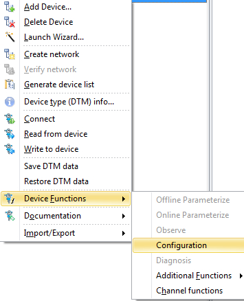

# Communicating with Foundation Fieldbus Devices
# Run 2

Using the [Fieldcare](../fieldcare/fieldcare.md) package on the workstation to communicate with [Foundation Fieldbus](../indexes/index_devices_ff.md) devices installed on [Run 2](../flow_runs/run_2.md)

Create Project

In the Network pane right click *Host PC* & select *Add Device*

Add *1757-FFLD4*

In the Network pane right click *1757-FFLD4 - Device Functions - Configuration*

In the DTM frame click *AB_FFLD* in the HSE Live List - It may take a few seconds for the HSE Live List to populate

The status should now turn green & indicate *Comm DTM assigned*

In the Network pane right click *1757-FFLD4 - Create network*

Press OK to scan all 4 channels

Wait for the Scanning to complete

To connect to the required device, In the *Network pane* right click on the required device and select *Connect*

The Connection icon will turn from grey to green when connected

Disconnected	Connected

Double click on the green connection icon

*Online Parameterize* will now appear in the DTM frame

