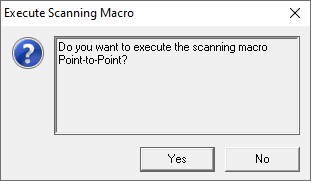
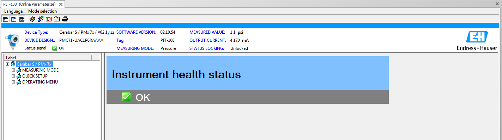

# Direct connection to HART Devices using modem

For direct connection a [HART Modem](hart_modems.md) is required

Using the [Fieldcare](../../../fieldcare/fieldcare.md) package on the workstation to communicate with [HART](../../../indexes/index_devices_hart.md) devices

The Connection icon will turn from grey to green when connected

Disconnected	Connected

Double click on the green connection icon

*Online Parameterize* will now appear in the DTM frame

