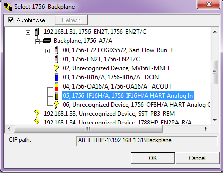

# Communicating with Devices via HART Network Connection - Run 3

Using the [Fieldcare](../../../fieldcare/fieldcare.md) package on the workstation to communicate with [HART](../../../indexes/index_devices_hart.md) devices installed on [Run 3](../../../flow_runs/run_3.md)

Create Project

In the Network pane right click *Host PC* & select *Add Device*

Add *RSLinx 1756 Backplane*

In the Network pane right click *RSLinx 1756 Backplane - Device Functions - Configuration*

Click *Select Path* & drill down

	AB_ETHIP-1,Ethernet
	192.168.1.31, 1756-EN2T, 1756-EN2T/C
	Backplane,1756-A7/A
	05, 1756-IF16H/A, 1756-IF16H/A HART Analog In

Press OK

In the Network pane right click *RSLinx 1756 Backplane* & select *Add Device*

Select *1756-IF16H*

Select- *Slot Number 5* click OK

In the Network pane right click *1756-IF16H * *- Create network*

Press OK in the Select Communication dialog box

Wait for the Scanning to complete

To connect to the required device, In the *Network pane* right click on the required device and select *Connect*

The Connection icon will turn from grey to green when connected

Disconnected	Connected

Double click on the green connection icon

*Online Parameterize* will now appear in the DTM frame

