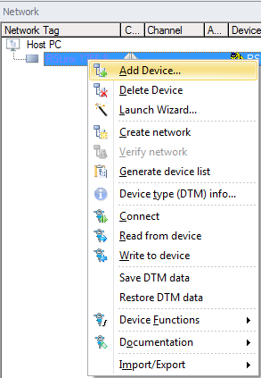
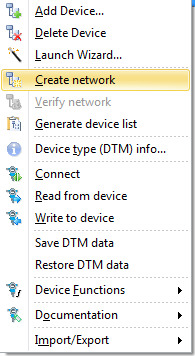
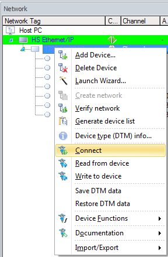

# Communicating with Profibus Devices
# Run 2

Using the [Fieldcare](../../fieldcare/fieldcare.md) package on the workstation to communicate with [Profibus](../../indexes/index_devices_profibus.md) devices installed on [Run 2](../../flow_runs/run_2.md)

Create Project

In the Network pane right click *Host PC* & select *Add Device*

Select *HS Ethernet/IP*

In the Network pane right click *HS Ethernet/IP* & select **Add Device**

Select **1788-EN2PAR**

In the Network pane right click **R1788-EN2PAR** & select Device Functions - Configuration

Enter *Module IP Address* **192.168.1.23**

Press Enter - Ensure green check mark is displayed

Enter *Max Scan Address* **126**

Press Enter - Ensure green check mark is displayed

In the Network pane right click **1788-EN2PAR - Create network**

Wait for the Scanning to complete

To connect to the required device, In the *Network pane* right click on the required device and select *Connect*

The Connection icon will turn from grey to green when connected

Disconnected	Connected

Double click on the green connection icon

*Online Parameterize* will now appear in the DTM frame

